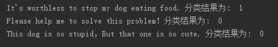

# *实验一 贝叶斯分类器的设计及应用实验*

## *实验内容*

**1.将上面的词集模型代码整合，并自己编写文本切分和测试程序，分类下列文本：**

> l “It’s worthless to stop my dog eating food.”
>
> l “Please help me to solve this problem!”
>
> l “This dog is so stupid，But that one is so cute.”

**测试及切分程序**

```python
def testNBO():
  postingList, classVec = loadDataSet()  # 对数据进行加载
  myVocabList = createVocabList(postingList)  # 建立词汇表
  trainMat = []
  for doc in postingList:
    trainMat.append(setWordsToVec(myVocabList,doc))
  p0Vect,p1Vect,pAbusive = trainNB0(trainMat,classVec)

  testEntry = ["It's worthless to stop my dog eating food.",
        "Please help me to solve this problem!",
        "This dog is so stupid，But that one is so cute."]
  for test in testEntry:
    doc = setWordsToVec(myVocabList,test.lower().split()) #小写转换，并完成句子切分
    print(test,'分类结果为: ',classifyNB(doc,p0Vect,p1Vect,pAbusive))

 
```

**分类结果**



分类结果并不准确。

第一个句子正确分类应为0，但是由于类别1的句子中包含worthless、dog单词较多，所以误分为1类。

第二个句子正确分类。

第三个句子正确分类。

**综合分析：**

单词采用类似one-hot的形式表示，仅仅能表示出单词是否出现，并不能体现词语的词频和上下文信息；所以分类并不准确。

**2.分类器修改：**

（1）进行平滑，防止样本中出现概率为0的情况，否则会影响整个句子概率的计算。

```
#p0Num = np.ones(numWords);p1Num = np.ones(numWords)#计算频数初始化为1
#p0Denom = 0;p1Denom = 0   

p0Num = np.ones(numWords);p1Num = np.ones(numWords)#计算频数初始化为1
p0Denom = 2.0;p1Denom = 2.0                        #即拉普拉斯平滑
```

（2）自然对数，解决值很小时出现下溢出（讲义中貌似没有修改）。

```
#p1Vect = p1Num/p1Denom
#p0Vect = p0Num/p0Denom

p1Vect = np.log(p1Num/p1Denom)#注意
p0Vect = np.log(p0Num/p0Denom)#注意
```

**3.词袋模型：**

```python
def bagOfWord2VecMN(vocabList,inputSet):#根据词汇表，讲句子转化为向量
  returnVec = [0]*len(vocabList)
  for word in inputSet:
    if word in vocabList:
      returnVec[vocabList.index(word)] += 1
  return returnVec
```

**分类结果**


分类结果并不准确。

第一个句子正确分类应为0，但是由于worthless出现在类别1中的次数较多，所以误分为1类。

第二个句子正确分类。

第三个句子正确分类。

**综合分析：**

词袋模型统计的不仅仅表示单词是否出现，还统计了单词出现的次数。但是由于本实验训练语料过少，并没有发挥应有的作用。