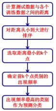
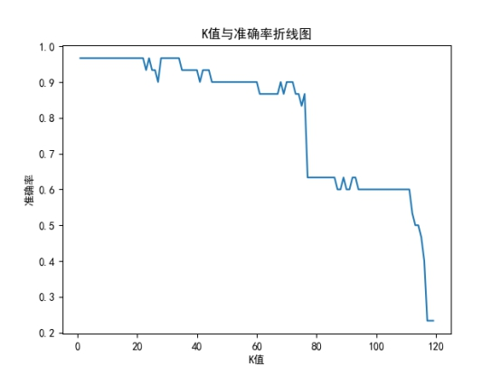
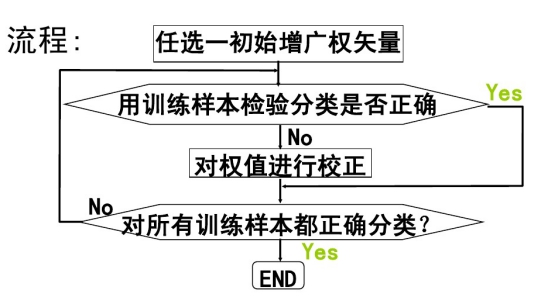
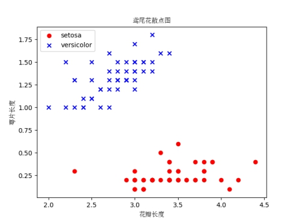
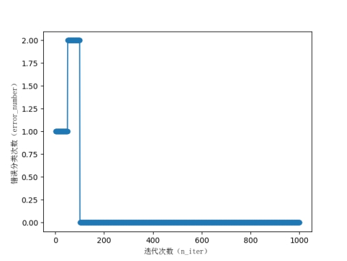
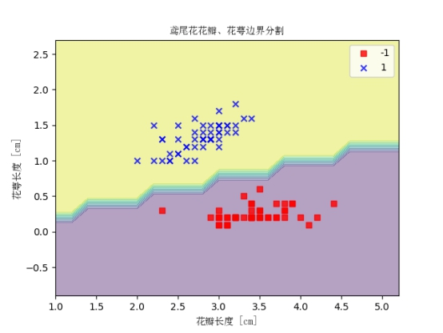

# *实验一 KNN&多项式分类器的设计及应用实验*

## *一、KNN分类器的构造*

**1.KNN算法的思路:**

​		存在一个样本数据集合，称为训练样本集，且样本集中每个数据都存在标签，即样本集
中每一数据与所属分类的对应关系。
​		输入没有标签的数据后，将新数据中的每个特征与样本集中数据对应的特征进行比较，
提取出样本集中特征最相似数据（最近邻）的分类标签。选择 k 个最相似数据中出现次数最多的分类作为新数据的分类。

**2.算法步骤：**

（1）计算未知实例到所有已知实例的距离；
（2）选择参数 K ；
（3）根据多数表决 ( majority-voting ) 规则，将未知实例归类为样本中最多数的类别。

**3.核心代码：**

```python
class KNN():
    """ K 近邻分类算法.
    Parameters:
    -----------
    k: int
    最近邻个数.
    """

    def __init__(self, k=5):
        self.k = k

    # 计算一个样本与训练集中所有样本的欧氏距离的平方
    def euclidean_distance(self, one_sample, X_train):
        one_sample = one_sample.reshape(1, -1)

        X_train = X_train.reshape(X_train.shape[0], -1)
        distances = np.power(np.tile(one_sample, (X_train.shape[0], 1)) - X_train, 2).sum(axis=1)

        return distances

    # 获取 k 个近邻的类别标签
    def get_k_neighbor_labels(self, distances, y_train, k):
        k_neighbor_labels = []

        for distance in np.sort(distances)[:k]:
            label = y_train[distances == distance][0][0] # 距离相同的可能会有多个，此时默认选第一个。
            k_neighbor_labels.append(label)
        return k_neighbor_labels

    # 进行标签统计，得票最多的标签就是该测试样本的预测标签
    def vote(self, one_sample, X_train, y_train, k):
        distances = self.euclidean_distance(one_sample, X_train)

        # print(distances.shape)
        y_train = y_train.reshape(y_train.shape[0], 1)
        k_neighbor_labels = self.get_k_neighbor_labels(distances, y_train, k)
        # print(k_neighbor_labels.shape)
        find_label, find_count = 0, 0
        for label, count in Counter(k_neighbor_labels).items():
            if count > find_count:
                find_count = count
                find_label = label
        return find_label

    # 对测试集进行预测
    def predict(self, X_test, X_train, y_train):
        y_pred = []
        for sample in X_test:
            label = self.vote(sample, X_train, y_train, self.k)
            y_pred.append(label)
            # print(y_pred)
        return np.array(y_pred)
```

**4.KNN流程图**



**5.K值比较**



可以看出，K值在1-20时准确率较高，在20以后开始下降，其中K=70和K=110时下降最为明显。

## *二、感知机模型的构造*

**1.感知机原理**

感知机是一个二类分类的线性分类器，是支持向量机和神经网络的基础。假设数据是线

性可分的，目标是通过梯度下降法，极小化损失函数，最后找到一个分割超平面，可以将数

据划分成两个类别。

**2..核心代码**

```python
class Perceptron(object):
    """
    eta:学习率
    n_iter:权重向量的训练次数
    w_:神经分叉权重向量
    errors_:用于记录神经元判断出错次数
    """
    def __init__(self,eta=0.01,n_iter=10):
        self.eta=eta;
        self.n_iter=n_iter
        pass

    def net_input(self, X):
        """
        z = W0*1+W1*X1 + ...+Wn*Xn
        """
        return np.dot(X, self.w_[1:]) + self.w_[0]
        pass

    def predict(self, X):
        return np.where(self.net_input(X) >= 0.0 , 1, -1)
        pass

    def fit(self,X,y):
        """
        输入训练数据，培训神经元，X输入样本向量，y对应样本分类
        X：shape[n_samples,n_features]
        X:[[1,2,3],[4,5,6]]
        n_samples:2
        n_features:3
        y:[1,-1]
        """

        """
        初始化权重向量为0
        加一是因为前面算法提到的w0，也就是步调函数阈值
        """
        self.w_ =np.zeros(1 + X.shape[1])
        self.errors_=[]
        for _ in range(self.n_iter):
            errors = 0
            """
            X:[[1,2,3],[4,5,6]]
            y:[1,-1]
            zip(X,y) = [[1,2,3 1],[4,5,6 -1]]
            """
            for xi,target in zip(X,y):
                """
                update = n * (y-y')
                target为真实值，self.predict(xi)为预测值（1 or -1）
                当两者相同，即预测正确时，差值为0，不更新
                当两者不同，即预测错误时更新。
                """
                update = self.eta * (target - self.predict(xi))

                """
                xi是一个向量
                update * xi 等价：
                {W(1) = X[1]*update, W(2) = X[2]*update, W(3) = X[3]*update}
                """
                self.w_[1:] += update * xi
                self.w_[0] += update

                errors += int(update !=0.0)
                self.errors_.append(errors)
                pass
            pass
        pass
```

**3.感知机流程图**



**4.花萼宽度（第 2 列）、花瓣宽度（第 4 列）特征分析**



从图中可以看出setosa的花瓣长度和萼片长度均小于versicolor，在该平面上存在一条分隔线可以将2者区分，即可用感知器进行分类。

**5.模型训练错误分类次数和迭代次数分析**



由上图可知，当迭代次数大于等于180时，感知器分类正确率较高且趋于稳定。

**6.观察感知机训练出的分类边界**



观察上图可知，感知器将所有样本均正确划分。

