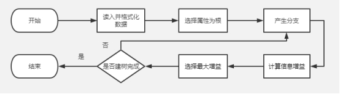
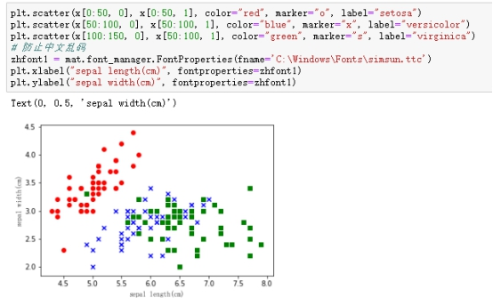
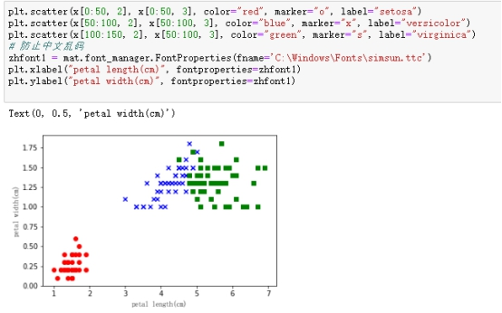
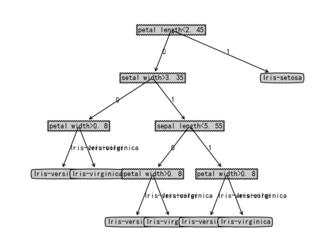
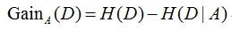
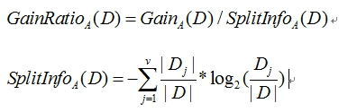
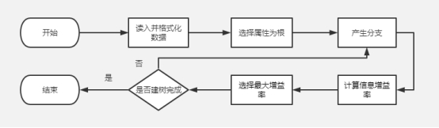
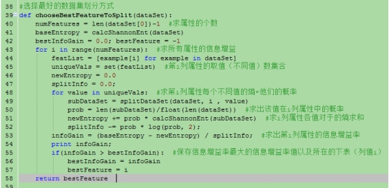
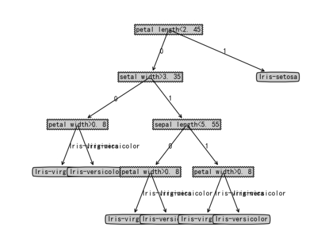

***\*实验\*******\*三\**** ***\*决策树分类器的构建及应用实验\****

 

# ***\*一、ID3算法\****

 

## ***\*1.\*******\*算法的思路:\****

ID3 算法以信息论为基础，以信息熵和信息增益为衡量标准实现对数据的归纳分类。在 ID3 算法中，每次划分选取信息增益最高的属性为划分标准，重复这个过程，直至生成一个能完美分类训练样例的决策树。

***\*2.\*******\*算法步骤：\****

(1) 构造函数 createDataSet

(2) 计算信息熵

(3) 利用构造的数据测试 calcShannonEnt

(4) 按照最大信息增益划分数据集

(5) 创建决策树构造函数 createTree

(6) 将决策树运用于分类

(7) 使用 Matplotlib 绘制决策树

 

**3.** ***\*ID3流程图\*******\*：\****

 

 

 

***\*4.\*******\*构建决策树对鸾尾花数据集进行分类\****

（1）数据分析

 

通过对鸢尾花的第1、2维特征进行分析，我们发现第1维特征（sepal length）明显的分界线为5.5，第2维特征（sepal width）明显的分界线为3.3。

 

 

通过对鸢尾花的第3、4维特征进行分析，我们发现第3维特征（petal length）明显的分界线为2，第4维特征（petal width）明显的分界线为1。

 

（2）连续性特征离散化

mydat = list(np.where(x[:,0]<5.5, 1, 0))
mydat = np.vstack([mydat,list(np.where(x[:,1]<3.3, 1, 0))])
mydat = np.vstack([mydat,list(np.where(x[:,2]<2, 1, 0))])
mydat = np.vstack([mydat,list(np.where(x[:,3]<1, 1, 0))])

 

（3）结果分析

 

 

# **二、*****\*C4.5算法\****

 

## ***\*1.\*******\*算法的思路:\****

C4.5 在 ID3 的基础上改进，引入了新概念“信息增益率”,C4.5 是选择信息增益率最大的属性作为树节点。

信息增益：

信息增益率：

***\*2.\*******\*算法步骤：\****

(1) 构造函数 createDataSet

(2) 计算信息熵

(3) 利用构造的数据测试 calcShannonEnt

(4) 按照信息增益率划分数据集

(5) 创建决策树构造函数 createTree

(6) 将决策树运用于分类

(7) 使用 Matplotlib 绘制决策树

 

***\*3.C4.5流程图\*******\*：\****

 

***\*4.\*******\*构建决策树对鸾尾花数据集进行分类\****

（1）C4.5算法改进

C4.5相比ID3算法最大区别是：C4.5 引入了新概念“信息增益率”,C4.5 是选择信息增益率最大的属性作为树节点。

 

（2）结果分析

 