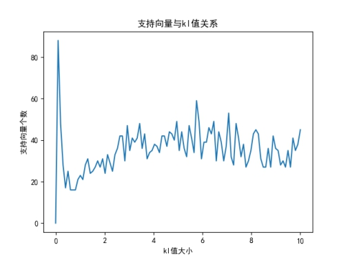

***\*实验\*******\*四\**** ***\*利用 SVM 实现分类实验\****

 

 

# **一、** ***\*使用 SVM 进行数据点分类\**** 

## ***\*1.\*******\*利用 SMO 优化算法，对线性可分数据进行分类:\****

def loadDataSet(fileName):
  dataMat = [];
  labelMat = []
  fr = open(fileName)
  for line in fr.readlines():
    lineArr = line.strip().split('\t')
    dataMat.append([float(lineArr[0]), float(lineArr[1])])
    labelMat.append(float(lineArr[2]))
  return dataMat, labelMat

x, y = loadDataSet("testSet.txt")
b, alphas = smoSimple(x, y, 0.6, 0.001, 40)
w = calcWs(x, y, alphas)
showClassifer(x, y, alphas, w, b)

 

 

## **2.** ***\*针对非线性分类数据，使用核技巧，选用 RBF 进行分类:\****

TraindataArr,TrainlabelArr,alphas = testRbf(k1=1.3)
showClassifer(TraindataArr,TrainlabelArr,alphas)

 

 

 

***\*3.\*******\*算法步骤：\****

 

***\*4.SMO算法流程图\*******\*：\****

 

 

 

***\*5.简化SMO算法C值与错误率的关系\****

C值越大，运行时间越长。松弛因子(C)越大，表示样本点离超平面越近，如果松弛因子大于1，那么表示允许该样本点分错，所以说加入松弛因子是有成本的，过大的松弛因子可能会导致模型分类错误。

 

 

***\*6.核技巧\****

 

随着kI增大，支持向量个数也逐渐增大，但是训练错误率和测试错误率在kI=1.5时最低。

 

 

 

 

 

 

我们固定随机种子为42，以确保每次运行结果的一致性；kl值从0取到10，间隔为0.1；随之kl值的增大，我们发现支持向量个数呈现先增大后平稳波动的趋势，训练集误差在kl值较小时误差率较小且稳定，随着kl的进一步增大呈现上升趋势；测试集误差测试先下降后上升。

 

 