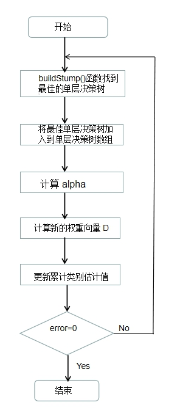
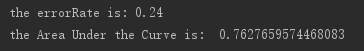
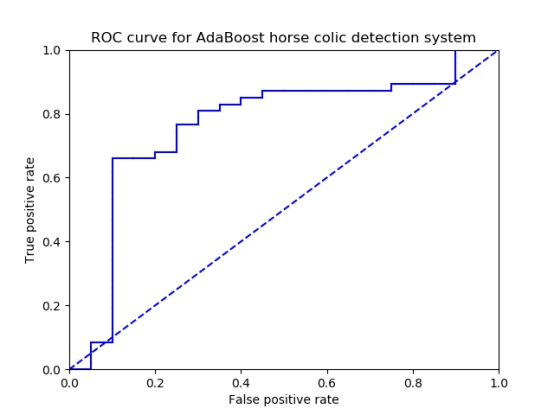
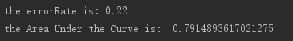
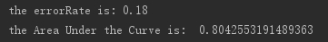
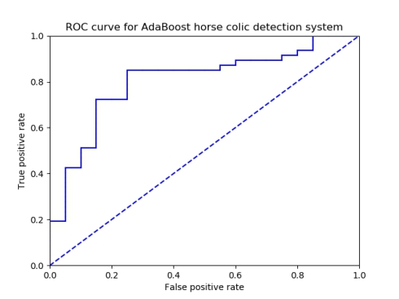

***\*实验\*******\*五\**** ***\*Adaboost实现分类器优化实验\****

 

# **一、** ***\*adaboost训练流程图\****

 

 

 

调试结果：

 

**二、** ***\*ROC 曲线\****

 

 

优化方法：

（1）更改基分类器的数目或类型

（2）调整基分类器的相关参数

 

 

 

 

 

 

 

 

 

 

 

 

弱分类器个数改为100时：

 

弱分类器个数改为100且buildStump中步长由10修改至100时：

 